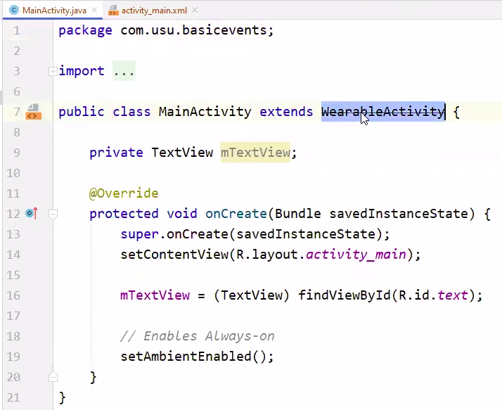
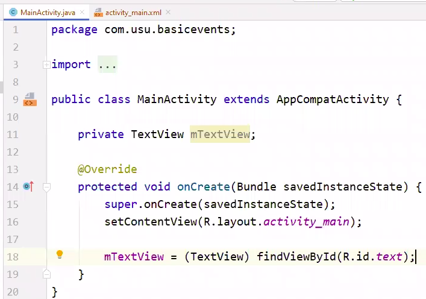
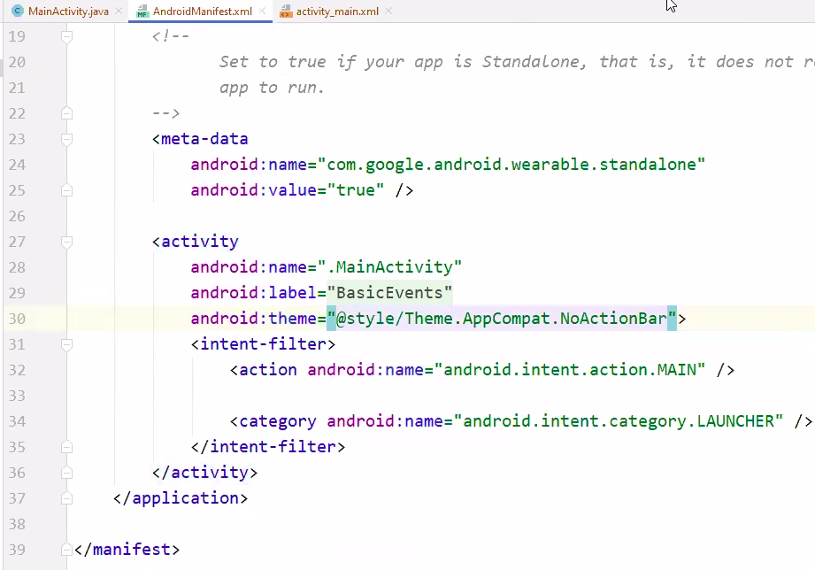

# APP (SETUP PROJECT)

## CHANGE `MainActivity` from `WearableActivity` to  `AppCompatActivity`
* remove `setAmbientEnabled();`
* you may need to add `import androidx.appcompat.app.AppCompatActivity;`

| Before | After |
|--------|-------|
|  | 

## ERROR
* Error: `You need to use Theme.AppCompat theme (or descendant of this activity)`
1. open `AndroidManifest.xml` (app --> manifests --> AndroidManifest.xml)
2. Add `android:theme="@style/Theme.AppCompat.NoActionBar"` in the `activity` tag

