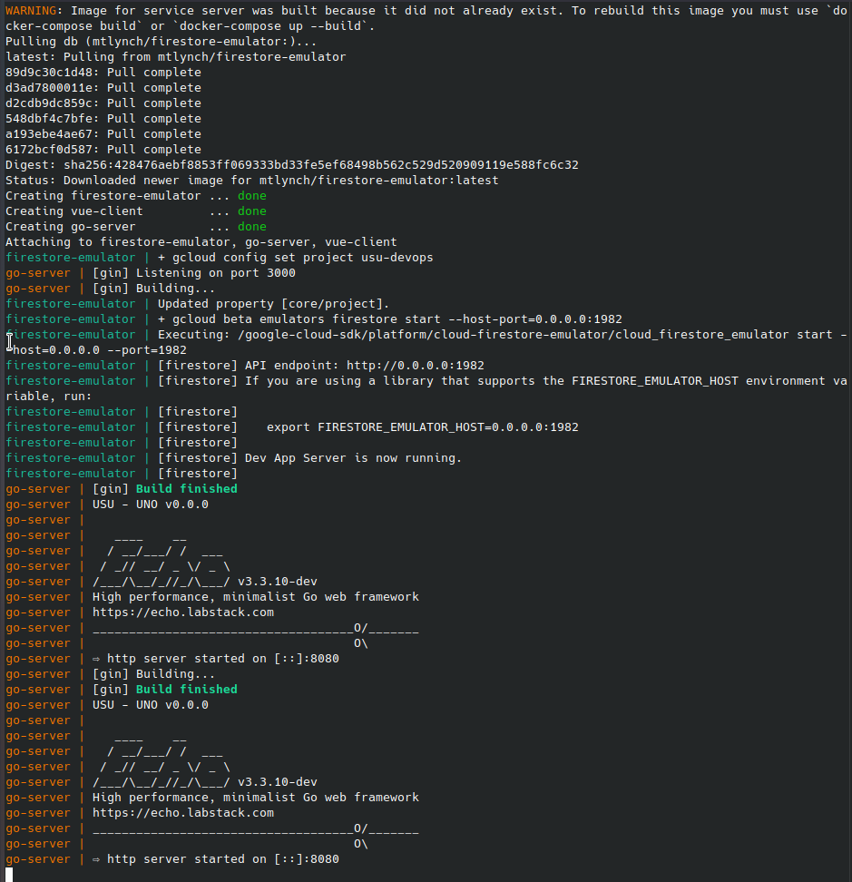
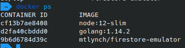
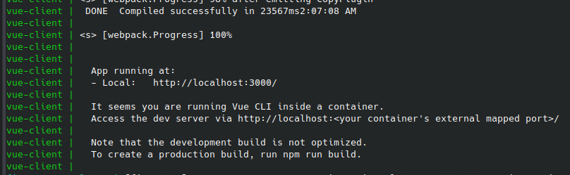

## Install dependencies
```bash
sudo apt-get remove docker docker-engine docker.io containerd runc -y
sudo apt update; sudo apt upgrade -y
sudo apt install apt-transport-https ca-certificates curl gnupg-agent software-properties-common -y
curl -fsSL https://download.docker.com/linux/ubuntu/gpg | sudo apt-key add -
sudo apt-key fingerprint 0EBFCD88
echo 'should match: 9DC8 5822 9FC7 DD38 854A  E2D8 8D81 803C 0EBF CD88'
sudo apt update
sudo add-apt-repository "deb [arch=amd64] https://download.docker.com/linux/ubuntu $(lsb_release -cs) stable"
#sudo add-apt-repository "deb [arch=armf] https://download.docker.com/linux/ubuntu $(lsb_release -cs) stable"
sudo apt-get install docker-compose docker-ce docker-ce-cli containerd.io -y
sudo docker run hello-world
cd ~/
wget https://dl.google.com/go/go1.14.4.linux-amd64.tar.gz
tar -xzf go1.14.4.linux-amd64.tar.gz
sudo mv go/bin/go /usr/bin
rm -rf go
rm go1.14.4.linux-amd64.tar.gz
```

## give yourself permissions
```sudo usermod -aG docker $USER```

## start docker daemon
```bash
sudo systemctl enable docker
sudo systemctl start docker
```
reboot computer


## Start Fresh
* ```sudo rm -rf uno; git clone https://github.com/jak103/uno```
* ```docker system prune -a```

## Start installation process inside uno repo
```bash
git checkout dev
echo '.git' > .dockerignore ### this fixed my problem of 'docker-compose up' hanging
docker-compose up
```

## Freezing point

Your program should get to here 



Do the following steps while it ```docker-compose up``` is running in the background:

On a new window execute the command ```docker ps```



look at the CONTAINER ID for node and type ```docker exec -it <container id> /bin/bash``` to load the shell.


in this example, you would run ```docker exec -it cf13b7ae8408 /bin/bash```

run ```npm install``` from the shell

after npm finishes installing, type ```exit```

on the open terminal with ```docker-compose up```, hit ```CTRL + c``` once and let it exit on its own

open the ```docker-compose.yml``` file and do the following:
* uncomment the line ```command: npm run-script serve```
* comment out the line ```command: bash -c "sleep infinity"```

run the command ```docker-compose down```

re-run the command ```docker-compose up```

you should get to here



## Finished!
go to ```http://localhost:3000``` in your browser and test it out
